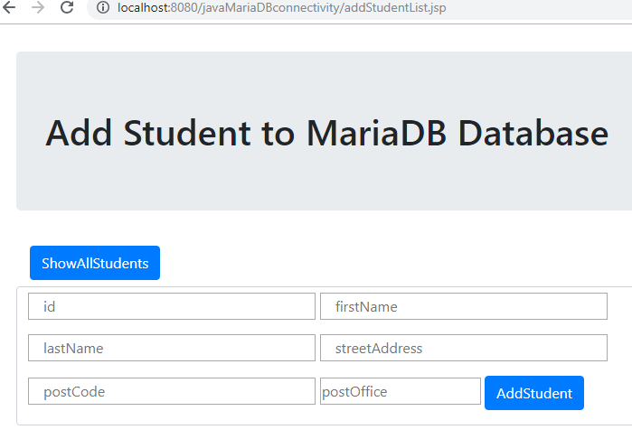

# java-mariadb project screen-shots

## Add Students to Database

## Show All List of Students

## Search Students by ID

## Delete Students by ID

## No Database Record Found With that ID

## Searching by ID

